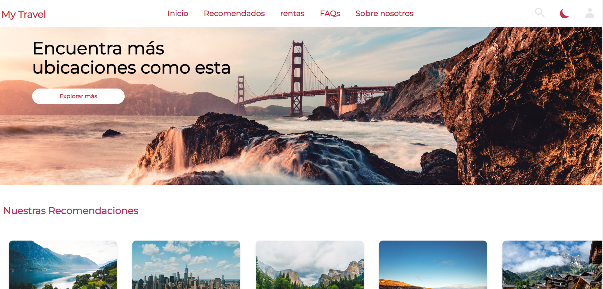
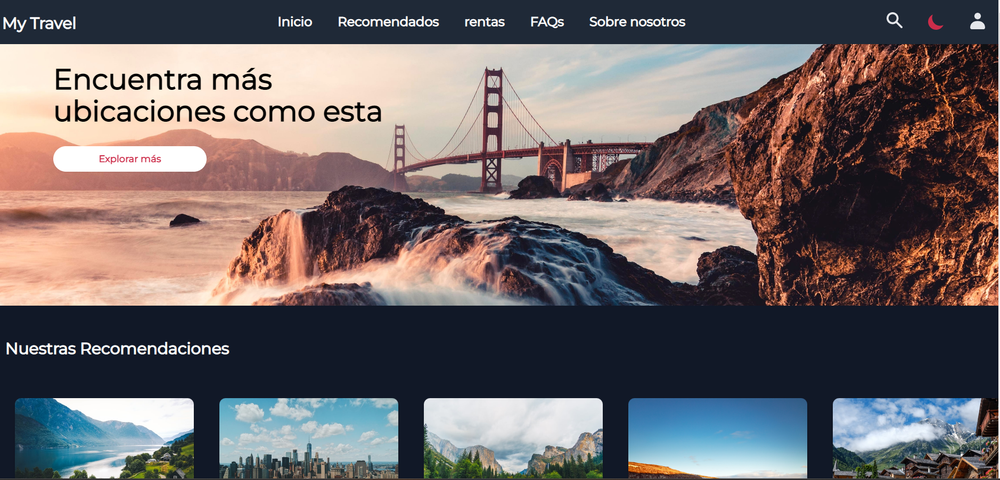

# my-travel
Página ficticia de viajes y responsive. Hecha con Tailwindcss. Dark mode aplicado. 

## Enlaces
Página: [GitHub](https://crontreras1.github.io/my-travel/)

## Construido con
- Tailwind

## Pantallazo 

Dark Mode: 

## Licencia
Licencia MIT

## Autor
Cristian Contreras: 
- GitHub: [crontreras1](https://github.com/crontreras1)
- Twitter: [@crontreras1](https://twitter.com/crontreras1)
